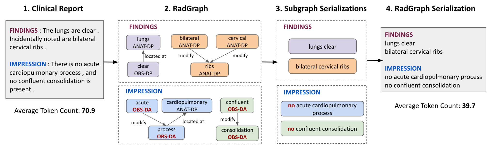

# Report Radgraph Serialization


## Setup
To download the relevant JSON files, see the dataset <a href = "https://physionet.org/content/radgraph/1.0.0/">here</a>, which mandates being a credentialed `physionet.org` user. To create RadGraphs for custom reports, also refer to the dataset link, which encapsulates details for running the named entity recognition (NER) and relation extraction (RE) model on report files. 

To obtain the requisite packages, run the following command:

```zsh
pip install networkx
```

## Usage
We provide command line interface for generating serialized graph reports (i.e. a text representation of each radiology knowledge graph) for a JSON file. To use the command line interface, run the `main.py` script—passing in the path to the input JSON file, an output CSV file path, a serialization method (see the table below; `subgraphs` is the method used in the paper). As a template,

```zsh
python main.py --json_path <path to RadGraph JSON> --csv_path out.csv --method_name subgraphs
```

This will generate a CSV file containing the serialized graph reports for each example in the input JSON file. The ID column in the CSV is the example key. The CSV file will have "id" as the first column, "full_report" as the last, and "serialization" in between, which stores the corresponding graph serialization as a string. The methods are described below.

method_name | details
--- | --- 
`subgraphs` (default) | Serialization based on weakly connected subgraphs.
`no_sep` | A listing of anatomical and observational entities + corresponding relations.
`with_anat` | A listing of observational entities + corresponding relations. A list of anatomical objects is provided at the end.
`with_@_anat`| A close variation of the previous `with_anat` method, except a suffix of @ is used for formatting the final serialization. 

## Subsequent Processing
The image-to-text vision backbone to map from the radiology image to the text serialization (`serialization` column of the output CSV) originates from (Nguyen et. al 2021); the repository is available at [here](https://github.com/ginobilinie/xray_report_generation). Alternatively, you can furnish and train a custom image-to-text model architecture. The central function of this individual module (`report-radgraph-serialization`) is to supply the dense, structured text outputs (i.e. RadGraph serialization).

Also, before prompting the LLM in the module `gpt-prompts-for-report-generation`, you'll want to revise the CSV file outputted above to include an `original` column containing the relevant report text; for our paper, we use Findings + Impressions from the MIMIC-CXR reports, though just Findings or just Impressions have been employed in prior literatures. Note that MIMIC-CXR reports are provided at the following PhysioNet <a href = "https://physionet.org/content/mimic-cxr/2.0.0/">link</a>, which—in the vein of the RadGraph Data—also requires being a credentialed user.  


